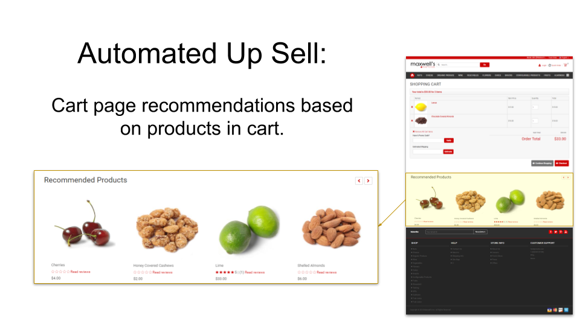

# Znode Recommendation Engine

Function documentation relating to a new Recommendation Engine feature.

First phase release targeting Q3 2019.

## Phase 1

## Terminology

**Recommendation Engine** - A system that recommends products that users are likely to buy. The rest of this document refers to this simply as the “engine”.

* AKA: “Recommender System”, “Information Filtering System”
* Further reading: http://en.wikipedia.org/wiki/Recommender_system

**Historical Context** - All information from the past that is considered by the engine to help inform recommendations.

* Ex: The history of orders placed in the system.

**Recommendation Context** - All information relating to a shopper’s specific point-in-time ‘state’ that is considered by the engine to inform the recommendation.

* Ex: This is a recommendation for shopper A.
* Ex: This is a recommendation for a shopper that is currently viewing product X.
* Ex: This is a recommendation for a shopper that currently has products X, Y, Z in cart.
* Important: Note that the shopper’s history is not part of the recommendation context. Rather, that information is already included in the historical context, allowing the engine to prepare to provide recommendations as quickly as possible when they are requested.

**Events** - Specific shopper actions/behaviors that are captured by the system and considered by the engine to inform recommendations.

* Ex: The shopper purchased products X,Y,Z in order A.
* Ex: The shopper viewed product X.
* Ex: The shopper added product X to the cart.
* Ex: The shopper removed product X from the cart.

**Recommendation** - The ‘matched’ products that are recommended, ordered by descending ‘score’.

**Match** - One product that is recommended (binary Yes/No).

**Score** - Number (on an arbitrary scale) which is the relative degree to which one product is recommended (scalar value).

## Events In-Depth

* Events will need to be handled in response to various business activities throughout Znode.
* Events are always captured with the DateTime of occurence (this allows us to place less ‘weight’ on older events if/where desired).

### Event Types & Frequency

Different types of events occur with different levels of freqency.

#### Very Frequent

Events that occur very frequently need to be handled carefully to avoid having the engine consume to many resources (CPU/RAM/HDD).

Ex:

* Shopper views a product.

#### Somewhat Frequent

Ex:

* Shopper adds/removes cart items.

#### Not Frequent

Events that occur very rarely can safely be included in the engine's historical context.

Ex:

* Shopper places order.

## Functional Scope of First Phase(s)

When shopper A browses the store (while being logged in):

* The Home Page will recommend products that any shoppers have purchased together with any products that shopper A has purchased.
* The PDP will recommend products that any shoppers have purchased together with the product currently being viewed.
* The Cart Page will recommend products that any shoppers have purchased together with any of the products currently in the cart.

The above rules inform the matches, ie: which products should be recommended. The next step is determining the score (determining display order) of those recommended products (similar to the search functionality's 'relevancy' score). Long term, this value can be calculated by taking many factors into consideration, but for the first phase I want to start with #1. We can also discuss whether we think #2 would be good to do.

1. Products purchased together most frequently are considered “related” and therefore “cross-recommended”.
1. Building upon #1, products purchased together in larger quantities are considered even more “related” and therefore more highly “cross-recommended”.

## Miscellaneous Notes

* [Google Slide Deck](https://docs.google.com/presentation/d/1mjx_E4aaJiLSAMpjT-pEXV7Ry4YEeTtiVhyQ5evdowI/edit?usp=sharing)
* Znode should gracefully degrade in the circumstance that the recommendation engine is unable to operate for any reason. In other words, the Web Store UI will simply display no banner of recommended products when either, (1) the engine is non-operable, or (2) no products were recommended.
  * Ex: The historical context was not yet built, so no recommendations can yet be made.
  * Ex: The engine in not functional due to a technical issue.

## Outstanding Questions

* Need to decide how to handle multi-catalog nature of Znode.
  * Have engine build a single model, based on global order history, keyed by SKU?
  * When recommendations are made, recommended products must be filtered to exclude products not in the catalog currently being used to populate Web Store.
    * If the provider of the recommendations (ie. API/engine) does the filtering…
      * …this can be handled by the engine, or the API service wrapping the engine. Either way, knowledge of product filtration must be provided/accessible.
    * If the consumer of the recommendations (ie: Web Store) does the filtering…
      * ... this would make the API’s/engine’s life easier, at the expense of unnecessary results transferring to Web Store, and the Web Store bearing the burden of doing the filtering.
    * Consider these points makes me lean towards having the API service logic that wraps the engine be responsible for filtering the products.
* How to handle products like “gatorade”, which Justin King gives as an example of a product that tends to be purchased on many orders, but isn’t necessarily related to the products with which it is purchased.

## Sequence Diagram

<a href="http://jgraph.github.io/drawio-github/edit-diagram.html?user=bsmith1310@gmail.com&org=bsmith1310&repo=znode-recs-engine-docs&path=docs/_assets/sequence-diagram.svg" target="_blank">Edit</a>

## Testing

TODO - Document